
<h1 align="center">《数据库系统原理》课程平台的设计与实现+vue</h1>

## 简介
数据库系统原理课程平台：角色分为管理员、教师、学生；功能包括论坛交流、教学资源管理、公告信息管理、用户管理、作业记录管理、资源下载与互动。    --计算机毕业设计源码；毕设源码；java毕业设计源码

## 联系方式

<h3 align="center">获取完整代码与数据库文件 + 微信：deepguan QQ: 86050149 QQ群: 783742310</h3>

<h3 align="center">可帮忙远程部署 包运行成功！提供远程部署、修改代码、设计文档指导、代码讲解等服务！</h3>

## 功能介绍（完整见运行截图）
管理员：管理员可以通过平台进行用户管理，包括用户的查询、新增、修改和删除操作，还能管理公告信息、论坛帖子、教学资源等，此外可以查看学生提交的作业记录以及管理讨论区的留言和回复。管理员登录后可以访问后台管理模块，进行综合管理任务，实现对教学平台的全面控制和优化。

教师：教师在平台上能够通过论坛交流模块发布和回复帖子，利用教学资源管理模块上传和管理教学资源，参与公告信息的发布，可以查看和回复学生在留言管理区的提问，还能通过作业记录模块查看学生提交的作业，进行在线答疑与互动，增强与学生的交流沟通。

学生：学生用户可以在平台上浏览和下载课程相关的教学资源，参与论坛讨论，发布和回复帖子，通过个人中心查看和修改个人信息及账户设置，通过留言管理模块与教师互动，还可以查看自己提交的作业记录及相关反馈，为自学提供支持。

游客：游客用户可以访问课程平台的首页查看公告信息及部分公开教学资源，浏览论坛中已有的帖子和回复，但不能参与互动和下载资源，需要注册账户并登录后方可享受全部功能，促进对平台的了解和使用转化。

## 运行截图
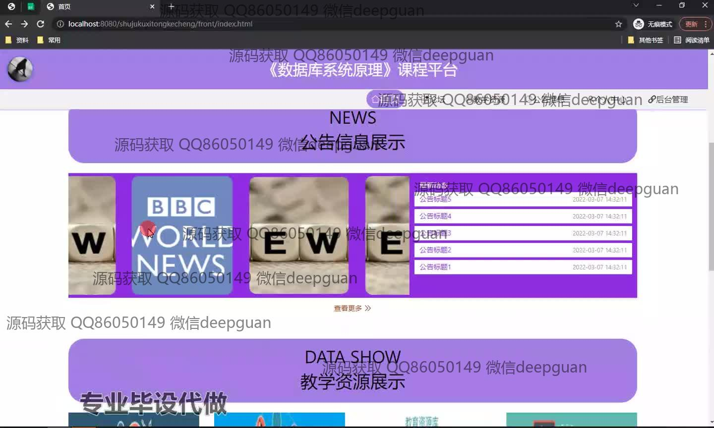
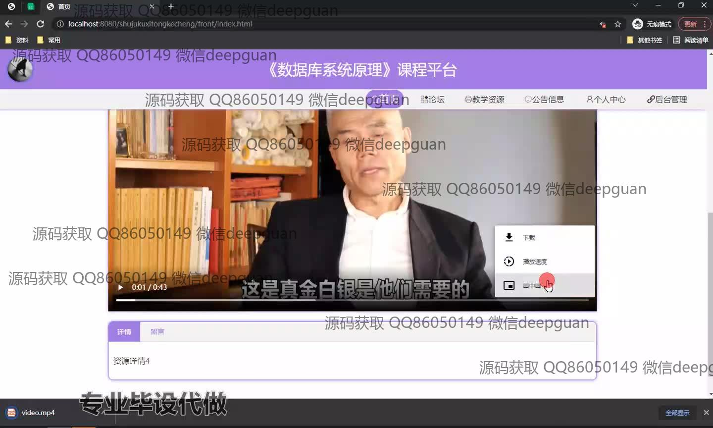

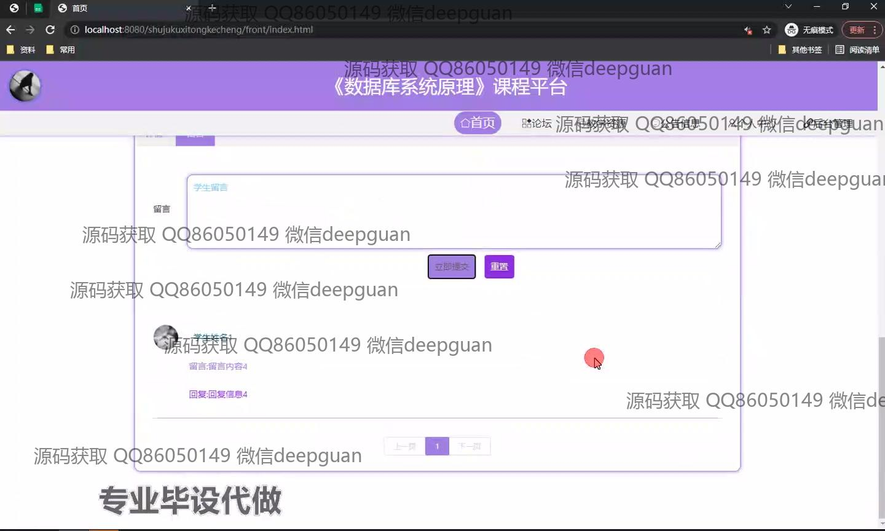
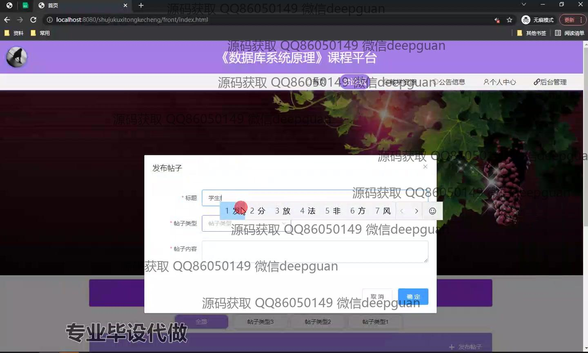
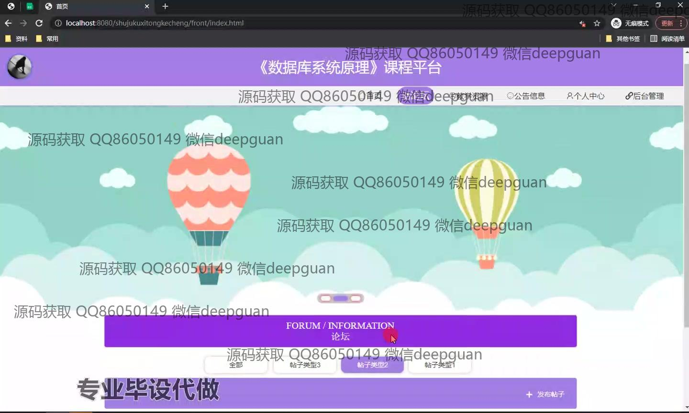
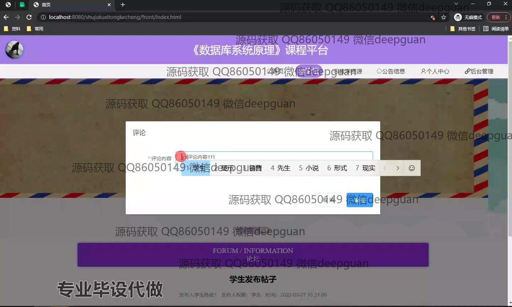
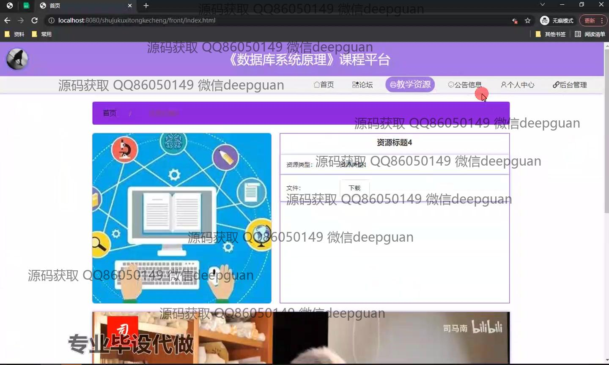
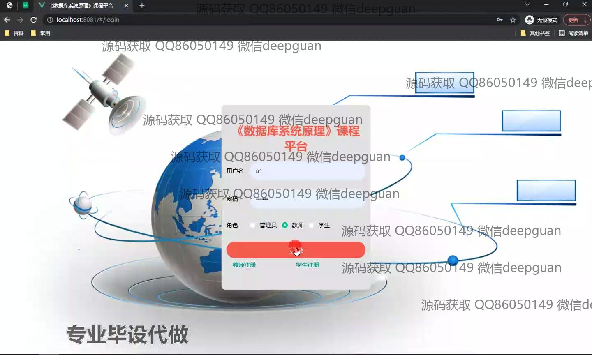
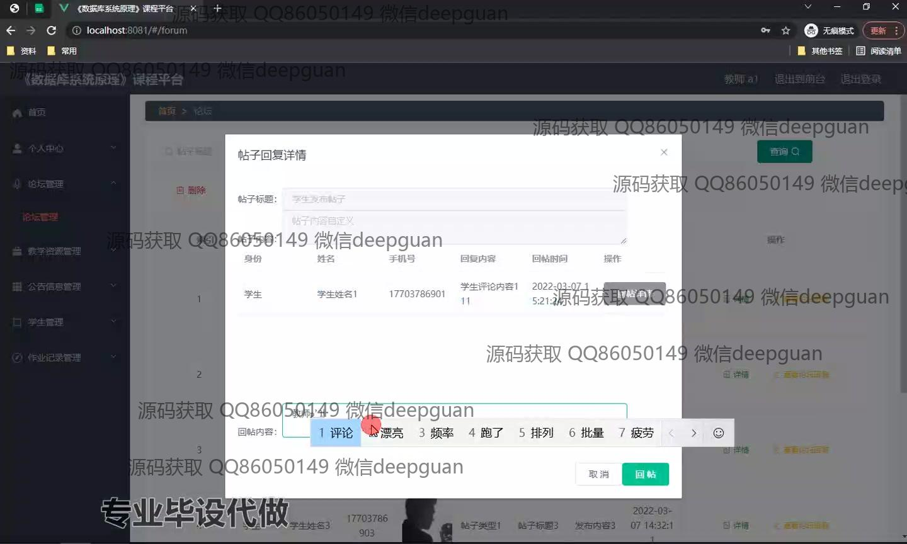
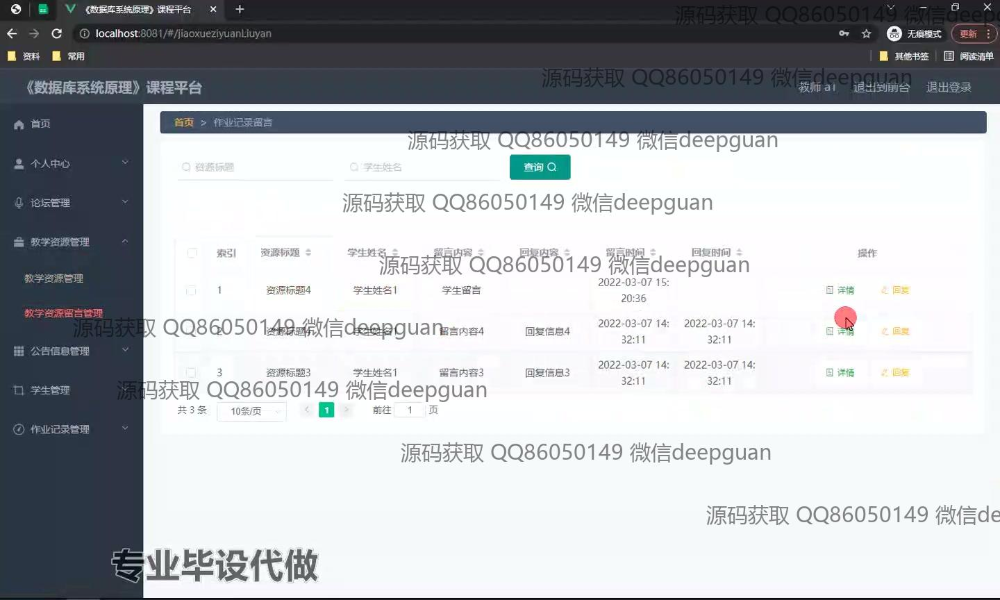
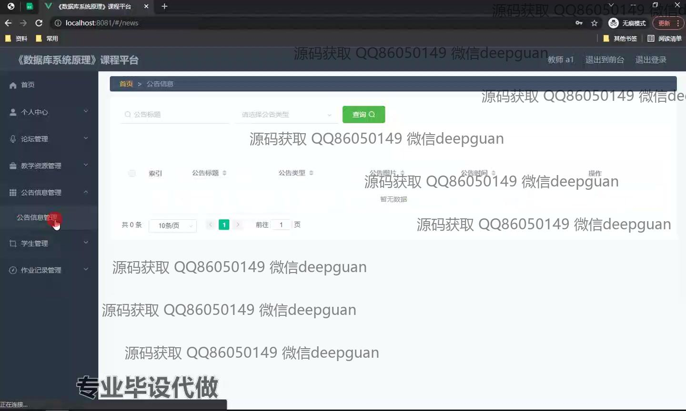
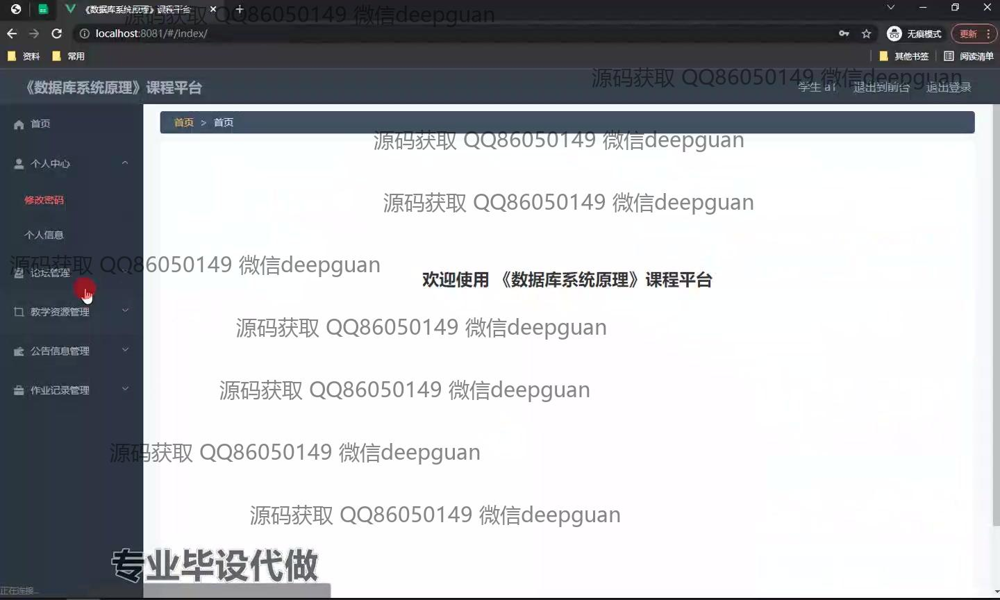
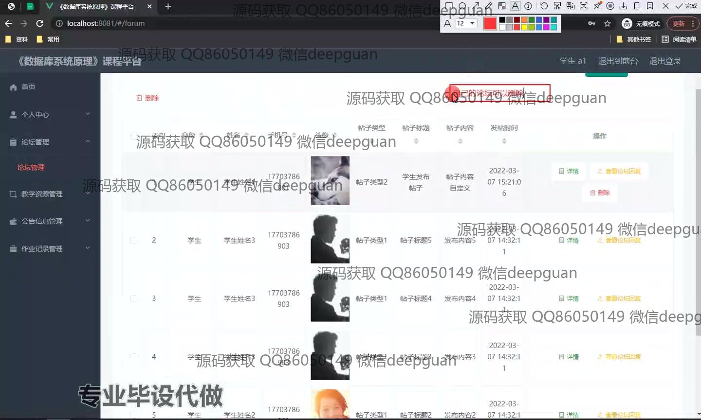
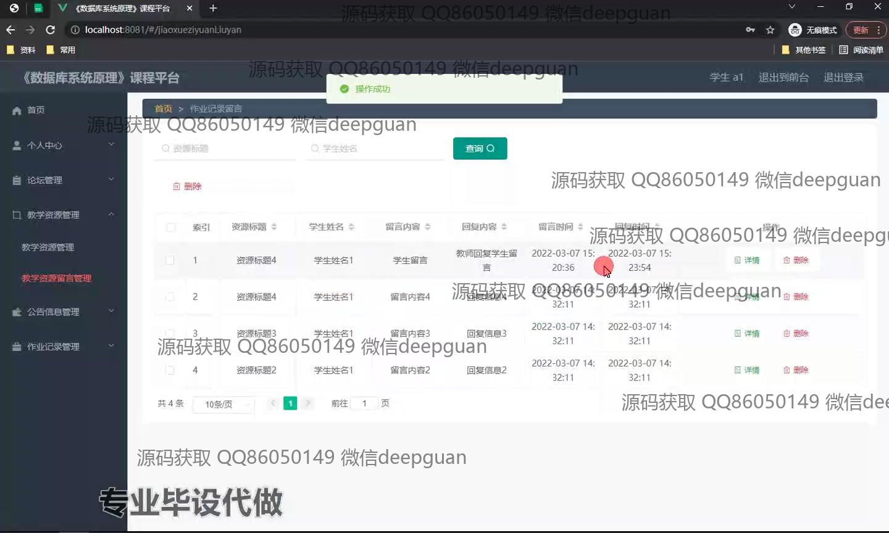
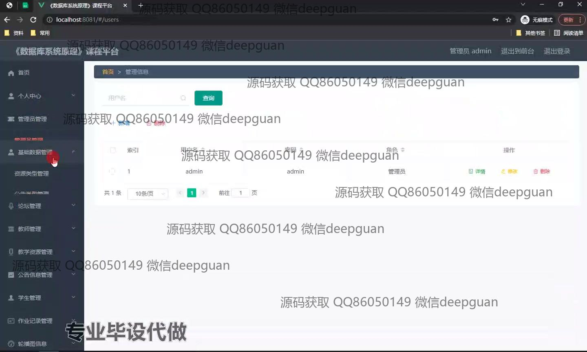
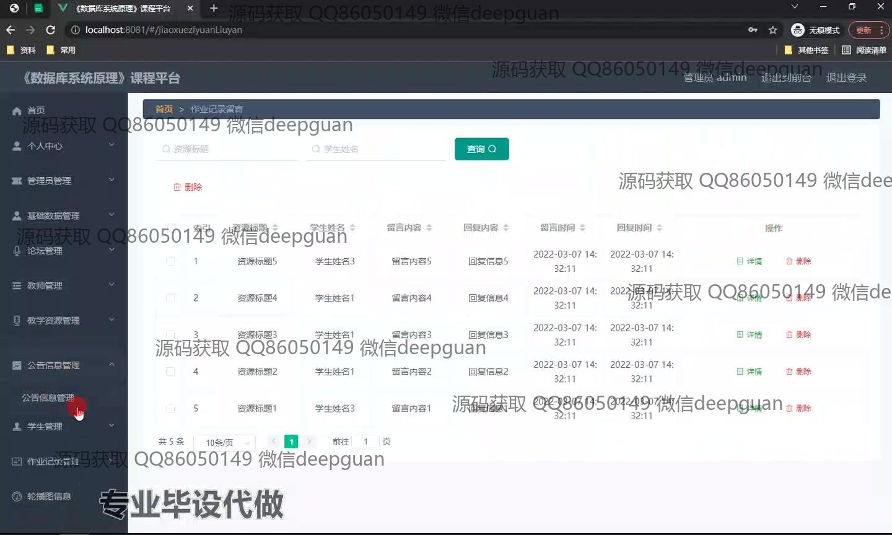
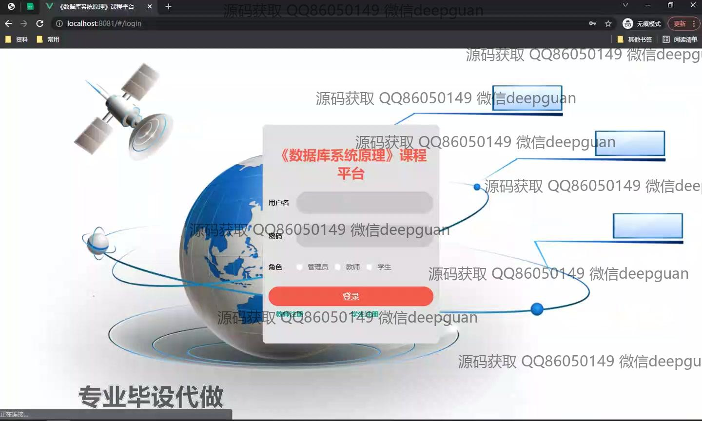

本代码来源于网络,仅供学习参考使用!

